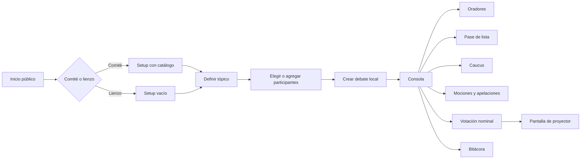
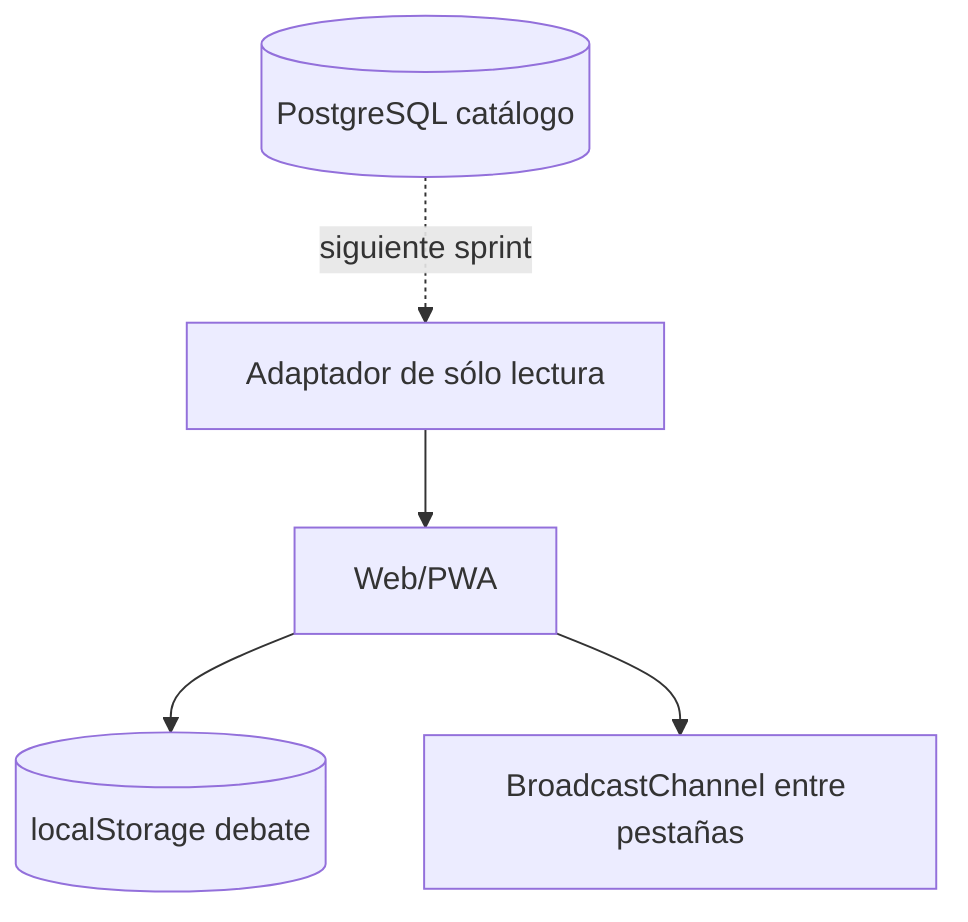

# Plan de implementación — Moderador ITAMMUN

**Estado:** primera versión local implementada

**Fecha:** 12 de agosto de 2026

**Objetivo:** validar el flujo de moderación con las organizadoras antes de conectar el catálogo real.

## 1. Decisiones incorporadas

- Sin cuentas. En local, cualquier persona con la URL puede entrar.
- Al publicar se puede definir una única contraseña para todo el subdominio.
- PostgreSQL será únicamente la fuente del catálogo: comités, colores, tópicos, países y banderas.
- El estado operativo del debate no se escribe en PostgreSQL; vive en el navegador.
- Inicio permite elegir un comité o crear un lienzo en blanco.
- Después de elegir se abre `Setup`: primero se define tópico y participantes; después se pasa a la consola.
- El lienzo en blanco admite participantes escritos libremente.
- Observadores aparecen en sala, pero no cuentan para quórum, mayorías ni votación.
- Todos los tiempos se escriben con teclado en `MM:SS` o `HH:MM:SS`.
- La regla `−1 segundo` sólo aparece al preparar una extensión de caucus.
- Caucus moderado guarda duración total y tiempo por orador.
- Las apelaciones viven en Mociones y abren una votación inmediata, no debatible.
- La votación es nominal por defecto y la pantalla pública muestra quién está votando.

## 2. Flujo implementado



No existe una pantalla de sincronización. La carga del catálogo ocurre al entrar a inicio/setup. La sesión resultante es local y se sincroniza únicamente entre pestañas del mismo navegador.

## 3. Borradores de ventanas

### V01 — Inicio

```text
┌──────────────────────────────────────────────────────────────┐
│ ITAMMUN · Moderador                          Acceso abierto  │
│                                                              │
│ ¿Qué comité vas a moderar?                                   │
│ [ONU Mujeres] [ACNUR] [UNICEF] [ICJ]                         │
│ [UNIDO] [CEPA] [Banco Mundial]                               │
│ [Consejo de Seguridad] [INTERPOL] [NATO]                     │
│                                                              │
│ [Lienzo en blanco · nombre opcional____________] [Crear]    │
└──────────────────────────────────────────────────────────────┘
```

Cada comité conserva los colores tomados del sitio ITAMMUN. Seleccionar una tarjeta abre su setup, no la consola directamente.

### V02 — Setup

```text
┌──────────────────────────────────────────────────────────────┐
│ ONU Mujeres                                  Setup debate   │
├───────────────────────┬──────────────────────────────────────┤
│ 01 · TÓPICO           │ 02 · PARTICIPANTES             33  │
│ [Tópico A        ▼]   │ [Buscar___________________________] │
│ o [Escribir tópico]   │ ☑ 🇲🇽 México                        │
│                       │ ☑ 🇫🇷 Francia                        │
│                       │ ☑ Estado de Palestina · Observador │
│                       │ [Nombre libre__________] [Agregar]  │
├───────────────────────┴──────────────────────────────────────┤
│ Tópico A · 33 participantes               [Iniciar debate] │
└──────────────────────────────────────────────────────────────┘
```

Crear setup del mismo comité reemplaza la sesión local anterior. No modifica el catálogo.

### V03 — Consola / oradores

```text
┌──────────────────────────────────────────────────────────────┐
│ ONU Mujeres · Guardado local  [Setup] [Pantalla] [Compartir]│
│ TÓPICO: Tópico A                                            │
├─────────────────────────────┬────────────────────────────────┤
│ ORADOR ACTUAL               │ PRÓXIMOS                      │
│ México                      │ 1. Francia                    │
│          00:43              │ 2. Nombre libre               │
│ Tiempo [01:00]              │ [país/persona_______][Agregar]│
│ [Reiniciar] [Pausar] [Sig.]│                                │
└─────────────────────────────┴────────────────────────────────┘
```

El campo acepta catálogo o texto libre. `Compartir` copia el enlace de setup; no promete colaboración entre dispositivos.

### V04 — Pase de lista

```text
┌──────────────────────────────────────────────────────────────┐
│ 18/33 en sala · 16 con voto · Hay quórum                   │
│ México                  [● Presente                 ▼]      │
│ Francia                 [● Presente y votando       ▼]      │
│ Alemania                [● Ausente                  ▼]      │
│ Santa Sede              [● Observador               ▼]      │
└──────────────────────────────────────────────────────────────┘
```

Estados: gris `sin registrar`, verde `presente`, dorado `presente y votando`, rojo `ausente`, azul `observador`. El texto siempre acompaña al color.

### V05 — Caucus y extensiones

```text
┌─────────────────────────────┬────────────────────────────────┐
│ CAUCUS MODERADO             │ EXTENSIÓN                     │
│          08:22              │ La extensión debe ser menor  │
│ Total [10:00]               │ Tiempo [09:59]                │
│ Por orador [00:45]          │ [Regla −1 segundo · 09:59]   │
│ [Reiniciar] [Pausar]        │ [Aplicar extensión]           │
└─────────────────────────────┴────────────────────────────────┘
```

Cambiar el total recalcula la propuesta a un segundo menos. El campo nunca acepta una extensión igual o mayor.

### V06 — Mociones / apelaciones

```text
┌──────────────────────────────────────────────────────────────┐
│ APELACIONES A LA MESA                  Mayoría simple       │
│ País/persona [México____]  Decisión [Descripción_________] │
│                                      [Registrar apelación] │
│ México · decisión procesal       [Abrir votación inmediata]│
└──────────────────────────────────────────────────────────────┘
```

La pregunta se formula como “¿Se revoca la decisión de la Mesa?”. Sólo se revoca si `a favor > en contra`; empate conserva la decisión.

### V07 — Votación nominal

```text
┌──────────────────────────────────────────────────────────────┐
│ VOTACIÓN NOMINAL                         Voto 4 de 16       │
│                         🇲🇽                                  │
│                    Emite su voto                            │
│                        México                               │
│ [A favor]          [En contra]          [Abstención]       │
└──────────────────────────────────────────────────────────────┘
```

La fila se forma con miembros `presente` o `presente y votando`. Los segundos no pueden abstenerse. El resultado muestra votos a favor, en contra y abstenciones.

### V08 — Pantalla de proyector

```text
┌──────────────────────────────────────────────────────────────┐
│ ITAMMUN                                      ONU Mujeres    │
│                    Voto 4 de 16                             │
│                         🇲🇽                                  │
│                    Emite su voto                            │
│                        México                               │
└──────────────────────────────────────────────────────────────┘
```

Es de sólo lectura. Al concluir muestra totales; fuera de votación muestra tópico y orador actual.

### V09 — Bitácora

Registra localmente alta y turno de oradores, extensiones, inicio de votación y resultado de apelaciones. Exportación y marcas de hora quedan para el siguiente sprint.

## 4. Arquitectura actual y futura



Hoy el adaptador usa fixtures TypeScript que corresponden al SQL de prueba. La futura conexión sustituirá sólo ese adaptador. No se crearán tablas de asistencia, oradores o votos en PostgreSQL salvo una decisión posterior explícita.

## 5. Recomendación de despliegue

Recomiendo una **web/PWA en el subdominio `moderador.itammun.itam.mx`**, no una aplicación nativa separada.

Motivos:

- una URL funciona en laptops, tabletas y el equipo de proyección;
- la misma base de código puede instalarse como aplicación desde navegadores compatibles;
- las actualizaciones llegan a todas las mesas sin distribuir instaladores;
- el subdominio aísla la consola del sitio público y permite aplicar contraseña, caché y políticas propias;
- el Worker actual puede conectarse a un dominio personalizado con HTTPS administrado por el proveedor.

En esta versión no se publica nada. La configuración DNS, el secreto `MODERATOR_PASSWORD` y la conexión real se harán cuando el equipo autorice el despliegue.

## 6. Fases siguientes

1. Validación con organizadoras: textos, estados, quórum, apelaciones y orden de votación.
2. Conectar el catálogo PostgreSQL real mediante un endpoint de sólo lectura.
3. Cronómetros resistentes a suspensión de pestaña y pantalla compartida de tiempo.
4. Historial con hora, correcciones y exportación.
5. Prueba de salón con proyector, laptop/tableta y red limitada.

## 7. Preguntas para la siguiente revisión

Estas preguntas no bloquearon el prototipo:

1. ¿El reglamento ITAMMUN confirma que una apelación se resuelve sin debate y por mayoría simple de presentes y votando?
2. ¿La llamada nominal debe seguir el orden del catálogo, orden alfabético o comenzar por un país elegido al azar?
3. ¿Además del país/persona que vota, la pantalla debe proyectar el sentido del voto inmediatamente o reservarlo hasta el resultado?
4. ¿La bitácora debe permitir correcciones visibles o ser inmutable?
5. ¿Qué vista o consulta del PostgreSQL existente se autorizará para leer el catálogo?

## 8. Criterios de aceptación cumplidos

- Inicio abierto, diez comités y lienzo en blanco.
- Setup previo con tópico y participantes.
- Países, banderas, observadores y colores de prueba.
- Oradores libres y pase de lista desplegable con texto/color.
- Tiempo por teclado en todos los campos configurables.
- `−1 segundo` sólo en extensión de caucus.
- Apelaciones y votación nominal con pantalla de proyector.
- Estado exclusivamente local y contraseña opcional para publicación.
- Compilación, lint y pruebas automáticas exitosas.
