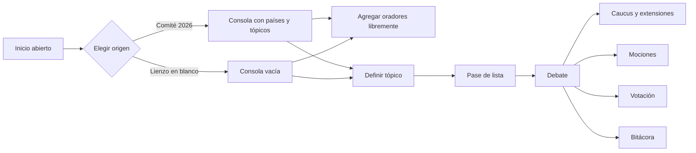
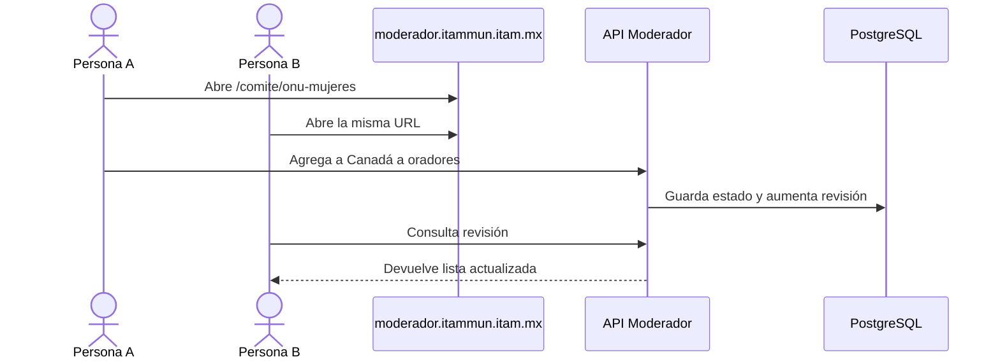
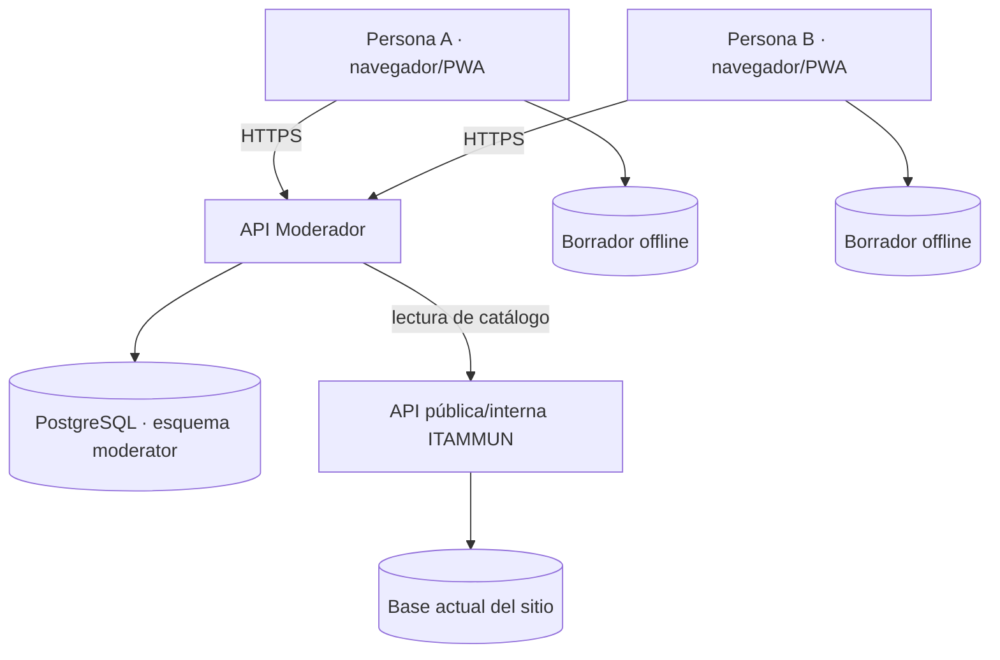

# Plan de implementación — Moderador ITAMMUN

**Estado:** segundo borrador incorporando retroalimentación  
**Fecha:** 12 de agosto de 2026  
**Objetivo:** validar una primera consola operativa antes de completar mociones, votación, bitácora y reportes.

## 1. Decisiones confirmadas

- La aplicación no tendrá acceso ni cuentas en esta etapa. Cualquier persona con el enlace podrá abrirla.
- La página inicial ofrece todos los comités de ITAMMUN 2026 y un lienzo en blanco.
- Elegir un comité abre directamente su consola. No existe una pantalla separada de sincronización ni de configuración.
- Varias personas pueden abrir la URL del mismo comité; el estado compartido se guarda por `committee_key` en PostgreSQL.
- La consola permite agregar oradores libremente, incluso escribiendo un nombre que no esté en el catálogo.
- El tópico se define dentro de la consola y es obligatorio antes de abrir el pase de lista.
- El pase de lista usa un menú desplegable con texto y color para cada estado.
- Todo tiempo configurable se escribe con teclado en formato `MM:SS` o `HH:MM:SS` y se confirma con Enter.
- `−1 segundo` se retira de los cronómetros normales. Sólo aparece al preparar una extensión de caucus.
- El despliegue recomendado sigue siendo una PWA en `moderador.itammun.itam.mx`.

## 2. Investigación y criterio de protocolo

### Agenda y tópico

La guía oficial de Model UN de Naciones Unidas explica que la agenda confirma el trabajo preparado antes de la conferencia y que el programa de trabajo define el tiempo destinado a cada punto y a los oradores. MUN Command separa la selección del comité de las acciones `Set Agenda` y `Conduct Roll Call`; no presenta una pantalla general de configuración como requisito previo.

Decisión para ITAMMUN: al abrir la consola, los oradores están disponibles de inmediato, pero **Pase de lista permanece deshabilitado hasta elegir o escribir un tópico**. Esto hace visible la regla sin interponer otra ventana.

Referencias:

- [ONU — Agenda, programa de trabajo y reglas de procedimiento](https://www.un.org/en/model-united-nations/agenda-workplan-documents-and-rules-procedure)
- [ONU — Desarrollo de la conferencia](https://www.un.org/en/model-united-nations/during-conference)
- [MUN Command — configuración de comité](https://session.muncommand.com/en/setup)

### Regla de un segundo menos

La interfaz de MUN Manager muestra un control `-0:01`, pero su manual público no documenta que deba descontarse tiempo al reloj activo. La evidencia protocolaria más clara encontrada está en reglas mexicanas de MUN:

- El protocolo alojado por la Cámara de Diputados indica que la extensión de un caucus moderado o inmoderado debe durar menos que el caucus original y que puede ser **un segundo menos**.
- TECMUN 2025 formula la misma regla para extensiones de caucus.
- La guía oficial de la ONU no define caucus ni esta regla; advierte que muchos MUN usan procedimientos parlamentarios propios que no son idénticos a los de la ONU.

Decisión de producto: en `Caucus y extensiones`, el sistema propone automáticamente `duración original − 00:01`. La mesa puede escribir un tiempo menor distinto. El sistema no permite que la extensión iguale o supere al caucus original.

Referencias:

- [Protocolo parlamentario alojado por la Cámara de Diputados, arts. 23–24](https://www5.diputados.gob.mx/index.php/esl/content/download/96091/481176/file/G20%20-%20Protocolo.pdf)
- [TECMUN 2025 — reglas de procedimiento](https://tec.mx/sites/default/files/repositorio/Campus/leon/munmx/documentos/2025/middle-school/1.pdf)
- [Manual de MUN Manager](https://ssinisterra.wordpress.com/mun-manager/)

Esta regla debe compararse con el protocolo oficial de ITAMMUN cuando esté disponible.

## 3. Datos del sitio y colores

La API pública vigente de ITAMMUN entrega:

- edición, subsecretarías y comités;
- UUID, slug, nombre, abreviatura, idioma y nivel;
- tópicos y representaciones por comité;
- nombre, UUID, bandera y disponibilidad de cada representación.

Endpoint observado: `GET /backend/public/api/public/debates/{committee_uuid}`.

La API pública **no entrega colores** y desde una respuesta HTTP no es posible confirmar el motor físico de la base de producción. Los colores se encontraron en el código visual publicado por el sitio. El repositorio incluye una migración PostgreSQL que los guarda en `moderator.committee_theme`:

| Comité | Acento | Fondo oscuro |
|---|---:|---:|
| ONU Mujeres | `#3C98A5` | `#1A3A3E` |
| ACNUR | `#82BAB7` | `#1C3635` |
| UNICEF | `#72B7BE` | `#1C3537` |
| ICJ | `#2D748E` | `#142D36` |
| UNIDO | `#7A966D` | `#1E2E1A` |
| CEPA | `#83A33E` | `#242E14` |
| Banco Mundial | `#3D8D2A` | `#162A12` |
| Consejo de Seguridad | `#837417` | `#2A2510` |
| INTERPOL | `#B79D3E` | `#2E2812` |
| NATO | `#E8B117` | `#332A0C` |

El navegador nunca recibe credenciales PostgreSQL. La API del moderador consulta la base y el sitio consume esa API.

## 4. Flujo actualizado



### Acceso compartido



No hay bloqueo exclusivo: varias personas pueden abrir y editar el mismo comité. Para evitar que una actualización antigua sobrescriba otra, cada guardado incluye `baseRevision`; un conflicto recibe la versión más reciente.

En el prototipo, si la API PostgreSQL no está disponible, la consola conserva un borrador local y sincroniza pestañas del mismo navegador. Este modo es contingencia, no sustituye al backend compartido.

## 5. Ventanas revisadas

### V01 — Inicio y selección de comité

```text
┌──────────────────────────────────────────────────────────────┐
│ ITAMMUN · Moderador                         Acceso abierto   │
│                                                              │
│ ¿Qué comité vas a moderar?                                   │
│                                                              │
│ [ONU Mujeres] [ACNUR] [UNICEF] [ICJ]                         │
│ [UNIDO] [CEPA] [Banco Mundial]                               │
│ [Consejo de Seguridad] [INTERPOL] [NATO]                     │
│                                                              │
│ [+ Lienzo en blanco · nombre opcional]                       │
└──────────────────────────────────────────────────────────────┘
```

Cada tarjeta usa el color vigente de ese comité. No hay cuentas, sesión de acceso ni selección exclusiva.

### V02 — Consola y tópico

```text
┌──────────────────────────────────────────────────────────────┐
│ ONU Mujeres    Borrador local / 2 conectados  [Compartir]   │
├──────────────────────────────────────────────────────────────┤
│ TÓPICO: [Seleccionar tópico…                         ▼]      │
│ Selección obligatoria antes del pase de lista                │
├──────────────────────────────────────────────────────────────┤
│ Oradores | Pase de lista🔒 | Caucus | Mociones | Votación   │
├──────────────────────────────┬───────────────────────────────┤
│ ORADOR ACTUAL                │ PRÓXIMOS                      │
│ Canadá                       │ 1. Japón                      │
│          00:43               │ 2. Alemania                   │
│ Tiempo [01:00]               │ [nombre libre________][Agregar]│
│ [Reiniciar] [Pausar] [Sig.] │                               │
└──────────────────────────────┴───────────────────────────────┘
```

El tiempo `01:00` es un campo editable con teclado. No contiene controles incrementales ni `−1 s`.

### V03 — Pase de lista

```text
┌──────────────────────────────────────────────────────────────┐
│ Pase de lista        18/25 presentes · Hay quórum           │
│ Presentes 18 · Con voto 16 · Simple 9 · Calificada 11      │
│                                                              │
│ Canadá                 [● Presente                  ▼]       │
│ Japón                  [● Presente y votando        ▼]       │
│ Alemania               [● Ausente                   ▼]       │
│ Sudán                  [● Observador                ▼]       │
└──────────────────────────────────────────────────────────────┘
```

Los estados se identifican con texto y color:

- gris: sin registrar;
- verde: presente;
- dorado: presente y votando;
- rojo: ausente;
- azul: observador.

El color nunca es la única señal. Las fórmulas definitivas se configurarán después de validar el protocolo ITAMMUN.

### V04 — Caucus y extensiones

```text
┌──────────────────────────────┬───────────────────────────────┐
│ CAUCUS ACTIVO                │ MOCIÓN DE EXTENSIÓN           │
│          08:22               │ Duración original 10:00      │
│ Duración [10:00]             │ Extensión [09:59]             │
│                              │ [Regla −1 segundo · 09:59]    │
│ [Reiniciar] [Pausar]         │ [Aplicar extensión]           │
└──────────────────────────────┴───────────────────────────────┘
```

Los dos tiempos se escriben con teclado. Al cambiar el tiempo original, la propuesta de extensión se recalcula a un segundo menos.

### V05 — Mociones

Se conserva el borrador anterior. El formulario de nueva moción permitirá seleccionar caucus moderado, inmoderado, extensión, sesión extraordinaria y otros tipos que defina ITAMMUN. Si la moción es una extensión, enviará al módulo V04.

### V06 — Votación

Se conserva el borrador anterior, sin `−1 s`. Cualquier tiempo requerido por una ronda o explicación se captura mediante teclado en `MM:SS`.

### V07 — Pantalla pública

Se conserva el borrador anterior. La pantalla es de sólo lectura y no muestra controles, borradores de voto ni amonestaciones.

### V08 — Bitácora y estadísticas

Se conserva el borrador anterior. El historial registra intervenciones, mociones, extensiones, votaciones y correcciones con revisión y hora.

### V09 — Cierre y recuperación

Se conserva el borrador anterior. Cerrar requiere confirmación y no existe una acción ordinaria para borrar la bitácora.

## 6. Arquitectura



### Integración de catálogo

No hay una ventana de sincronización. La integración ocurre en segundo plano:

1. Inicio solicita la lista de comités.
2. Al abrir uno, la consola solicita tópicos y representaciones.
3. Se guarda un snapshot para que una modificación posterior del sitio no altere una sesión ya iniciada.
4. El lienzo en blanco no consulta el catálogo.

### Persistencia compartida

El repositorio ya define:

- `moderator.committee_theme`: colores por comité;
- `moderator.committee_session`: estado JSONB y número de revisión;
- `moderator.committee_presence`: dispositivos activos durante los últimos 20 segundos;
- API abierta de lectura/escritura por `committee_key` con control optimista de revisión.

Antes de producción se debe decidir si el acceso abierto permitirá editar a cualquier visitante o si se limitará con un enlace secreto no indexable. Aunque no haya cuentas, un slug público como `onu-mujeres` es fácil de adivinar.

## 7. Modelo de tiempo

- Entrada: `MM:SS` o `HH:MM:SS`; también se acepta un número como segundos.
- Tecla Enter: confirma y normaliza el valor.
- El reloj guarda duración total y tiempo restante en segundos enteros.
- Pausar/reanudar usa una referencia temporal monotónica en la versión de producción para evitar deriva.
- Los cronómetros normales permiten editar, reiniciar, iniciar y pausar.
- La regla `−1 s` sólo calcula el máximo recomendado de una extensión de caucus.

## 8. Fases actualizadas

### Fase 0 — segundo borrador funcional, en curso

- Inicio abierto con diez comités y lienzo en blanco.
- Colores actuales por comité.
- Consola compartible, selector obligatorio de tópico y oradores libres.
- Pase de lista desplegable por color.
- Captura de tiempo por teclado.
- Extensión de caucus con regla de un segundo menos.
- Esquema y API PostgreSQL para varias personas.

### Fase 1 — conexión a infraestructura ITAMMUN

- Ejecutar migración en un esquema PostgreSQL de desarrollo.
- Confirmar tablas/vistas reales del sitio y sustituir el catálogo estático por endpoint interno.
- Configurar proxy `/api/moderator` bajo el subdominio.
- Probar dos navegadores en dispositivos distintos sobre el mismo comité.

### Fase 2 — reglas de sesión

- Validar estados de asistencia, quórum y mayorías.
- Implementar mociones y flujo completo de caucus.
- Cronómetros resistentes a suspensión de pestaña y pérdida de red.

### Fase 3 — votación, pantalla pública y bitácora

- Votación agregada o nominal según decisión.
- Pantalla de proyector.
- Registro inmutable, estadísticas y exportación.

### Fase 4 — piloto

- PWA instalable y cola offline.
- Pruebas con laptop, tableta, proyector y Wi‑Fi limitado.
- Simulacro con dos comités y capacitación de mesas.

## 9. Criterios de aceptación del siguiente sprint

- Cualquier persona abre inicio sin autenticación.
- Los diez comités coinciden con la API pública y muestran su color correcto.
- Un lienzo en blanco abre una URL única.
- Dos dispositivos que abren la misma URL ven la misma lista de oradores al conectar la API PostgreSQL.
- Se puede agregar un orador del catálogo o escribir uno libre.
- Pase de lista no se habilita antes de escoger tópico.
- Cada representación usa un desplegable legible con color y texto.
- No existe `−1 s` en oradores, votación ni cronómetros activos.
- La extensión propone exactamente un segundo menos y rechaza un tiempo igual o mayor.
- Todos los tiempos configurables pueden capturarse sin mouse.

## 10. Despliegue

Se mantiene la recomendación de una **PWA institucional en `moderador.itammun.itam.mx`** con API y PostgreSQL del lado servidor.

Ventajas:

- enlace único y fácil de compartir;
- varias mesas trabajan sin instalar software;
- una sola versión para todos;
- apariencia institucional;
- aislamiento respecto del sitio público;
- posibilidad de operación offline después del primer acceso.

No se recomienda una app nativa durante el MVP.

## 11. Preguntas abiertas para esta revisión

1. Sin cuentas, ¿cualquier persona con `moderador.itammun.itam.mx/comite/onu-mujeres` puede **editar**, o prefieren que el enlace de edición tenga un código secreto y que el enlace corto sea sólo lectura?
2. ¿El lienzo en blanco debe permitir agregar una lista completa de representaciones, o basta con escribir oradores libres?
3. ¿Cuáles son los estados exactos de asistencia que utiliza ITAMMUN? El borrador propone: sin registrar, presente, presente y votando, ausente y observador.
4. ¿Los observadores cuentan para quórum, mociones y mayoría en todos los comités o depende del tipo de comité?
5. ¿El caucus moderado necesita dos tiempos —total y por orador— o ITAMMUN usa solamente tiempo total?
6. ¿“Apelaciones” es un módulo distinto de extensiones de caucus en su protocolo? Si sí, ¿qué decisiones pueden apelarse y qué mayoría requieren?
7. ¿La votación final será conteo agregado o voto nominal por representación?
8. ¿Qué datos debe mostrar el proyector durante y después de una votación?
9. ¿Pueden compartir el protocolo oficial de ITAMMUN para reemplazar reglas provisionales por las definitivas?
10. ¿TI de ITAM proporcionará un esquema PostgreSQL de desarrollo y un endpoint interno, o debemos preparar un servicio separado con acceso de sólo lectura al catálogo?

