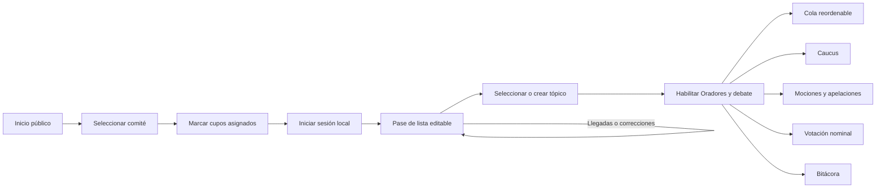

# Plan de implementación — segunda iteración

**Estado:** implementación completada; lint, build y pruebas automatizadas aprobadas

**Fecha:** 15 de agosto de 2026

**Objetivo:** adaptar la consola al orden real de una sesión y reducir pasos para la Mesa.

## 1. Decisiones confirmadas

- La aplicación será pública. No habrá contraseña, login ni campo de acceso.
- Setup no pedirá tópico; servirá para indicar qué países tienen cupo asignado inicialmente.
- Todos los países del catálogo del comité permanecerán disponibles en la consola, incluso si no tenían cupo al iniciar.
- El pase de lista será una pestaña siempre abierta y editable; no existe `Cerrar pase de lista`.
- Cada país tendrá botones para `Presente`, `Presente y votando`, `Ausente` y `Observador`.
- El tópico se selecciona o crea dentro de la consola después de comenzar el pase de lista.
- No puede haber oradores mientras no exista tópico.
- El tópico sólo puede modificarse cuando la cola de oradores está vacía.
- La cola podrá reordenarse arrastrando, con alternativa accesible por teclado.
- Los oradores se seleccionan del catálogo de participantes de la sesión; no existe captura de texto libre.
- Caucus elimina el tiempo por orador y la división en dos paneles.
- Caucus mostrará tópico, cronómetro, controles y la extensión `−1 segundo` en una sola vista.
- Todas las votaciones, incluidas apelaciones, incluyen únicamente países `Presente y votando`.
- No se conservará asistencia entre sesiones: al iniciar otra sesión se vuelve a pasar lista.

## 2. Viabilidad

| Cambio | Viabilidad | Impacto | Nota técnica |
|---|---|---:|---|
| Acceso completamente público | Alta | Bajo | Se retira la protección opcional del servidor y su configuración. |
| Países disponibles aunque no tengan cupo | Alta | Medio | Setup guardará asignaciones iniciales sin recortar el catálogo del comité. |
| Pase de lista siempre editable mediante botones | Alta | Medio | Sustituye desplegables; no requiere etapas ni cierre de asistencia. |
| Tópico posterior al inicio de asistencia | Alta | Medio | El tópico vacío bloquea módulos de debate, pero no Pase de lista. |
| Tópico editable sólo con cola vacía | Alta | Bajo | Se deriva directamente del estado de la cola. |
| Cola arrastrable | Alta | Medio | Requiere identificadores únicos y migración del estado local. |
| Caucus en una sola vista | Alta | Medio | Simplifica estado y diseño; no usa fullscreen del navegador. |
| Sólo vota `Presente y votando` | Alta | Bajo | Se cambia el filtro y se elimina abstención. |

Todos los cambios son compatibles con el estado local actual y no requieren guardar el debate en PostgreSQL.

## 3. Flujo revisado



No se necesita una propiedad `phase` ni un botón para finalizar asistencia. La regla de navegación es sencilla:

- Pase de lista siempre está disponible;
- sin tópico, los demás módulos están bloqueados;
- con tópico, se habilita el debate;
- si la cola contiene oradores, el tópico queda bloqueado;
- cuando la cola vuelve a estar vacía, el tópico puede modificarse.

## 4. Ventanas y comportamiento

### 4.1 Inicio público

La pantalla conserva los comités y el lienzo en blanco. `Acceso abierto` es sólo informativo.

**Cambios:**

- eliminar `MODERATOR_PASSWORD` del Worker, variables de entorno y documentación;
- no mostrar modal, formulario ni aviso de contraseña;
- mantener el acceso por enlace directo al comité.

### 4.2 Setup de cupos

Setup muestra todo el catálogo del comité. Marcar un país significa que tiene cupo/delegación asignada al comenzar, no que será eliminado o añadido al catálogo.

```text
┌──────────────────────────────────────────────────────────────┐
│ ONU Mujeres                              Preparar sesión    │
├──────────────────────────────────────────────────────────────┤
│ CUPOS ASIGNADOS AL INICIO                              18  │
│ [Buscar_______________________________________________]     │
│ ☑ 🇲🇽 México       ☑ 🇫🇷 Francia       ☐ 🇯🇵 Japón           │
│ ☑ 🇧🇷 Brasil       ☐ 🇨🇦 Canadá        ☐ 🇮🇳 India           │
│                                                              │
│ País/persona adicional [____________________] [Agregar]     │
├──────────────────────────────────────────────────────────────┤
│ 18 cupos iniciales                         [Iniciar sesión] │
└──────────────────────────────────────────────────────────────┘
```

Al crear la sesión se guardan dos elementos distintos:

- `participants`: catálogo completo más altas manuales;
- `assignedParticipantIds`: países con cupo asignado inicialmente.

Todos aparecen después en Pase de lista. Los asignados pueden mostrarse primero; los no asignados permanecen visibles debajo y pueden recibir cualquier estado si hay un cambio de último momento.

Iniciar una sesión nueva reinicia asistencia a `Sin registrar`; no se crea un historial de sesiones ni se reutiliza el pase anterior.

### 4.3 Pase de lista permanente

La consola abre en esta pestaña. No hay botón de cierre.

```text
┌────────────────────────────────────────────────────────────────────────┐
│ PASE DE LISTA                    18 en sala · 12 con voto             │
│                                                                        │
│ México   [Presente] [Presente y votando] [Ausente] [Observador]       │
│ Francia  [Presente] [Presente y votando] [Ausente] [Observador]       │
│ Japón    [Presente] [Presente y votando] [Ausente] [Observador]       │
│                                                                        │
│ TÓPICO DE LA SESIÓN                                                   │
│ [Seleccionar tópico… ▼]  o  [Escribir tópico________________]        │
└────────────────────────────────────────────────────────────────────────┘
```

Reglas de interacción:

- cada botón tiene texto, color y `aria-pressed`;
- área mínima de toque de 44 × 44 px;
- `Sin registrar` es el estado inicial y existe una acción `Limpiar` para volver a él;
- `Observador` es una opción igual que las demás, no un atributo bloqueado del país;
- los cambios pueden realizarse en cualquier momento;
- llegadas tardías y correcciones actualizan inmediatamente quórum y número habilitado para votar;
- países sin cupo inicial permanecen en la lista y pueden marcarse si se ocupan después.

### 4.4 Tópico y bloqueo de módulos

El selector de tópico vive dentro de la consola, asociado a Pase de lista. Puede usarse después de comenzar la asistencia sin cerrar esa pestaña.

```text
Sin tópico:
  Pase de lista ✓ | Oradores 🔒 | Caucus 🔒 | Mociones 🔒 | Votación 🔒

Con tópico:
  Pase de lista ✓ | Oradores ✓  | Caucus ✓  | Mociones ✓  | Votación ✓
```

Reglas:

- seleccionar o crear tópico habilita los módulos de debate;
- con una cola de oradores vacía, el selector permanece editable;
- al agregar el primer orador, el selector se bloquea y muestra `Vacía la cola para cambiar el tópico`;
- al retirar o terminar todos los elementos de la cola, vuelve a habilitarse;
- cada cambio de tópico se registra en Bitácora.

### 4.5 Cola de oradores reordenable

```text
┌──────────────────────────────────────────────────────────────┐
│ PRÓXIMOS ORADORES                                            │
│ ⠿ 1  México                   [↑] [↓] [Quitar]              │
│ ⠿ 2  Francia                  [↑] [↓] [Quitar]              │
│ ⠿ 3  Japón                    [↑] [↓] [Quitar]              │
└──────────────────────────────────────────────────────────────┘
```

Implementación:

- migrar `speakers: string[]` a `{ id, name }[]`;
- asa de arrastre compatible con mouse y touch;
- teclado para tomar, mover y soltar un elemento;
- botones `Subir` y `Bajar` como alternativa directa;
- anuncio accesible de la nueva posición;
- persistencia inmediata del orden;
- nombres repetidos permitidos gracias al identificador único.
- el alta usa un selector y rechaza cualquier valor que no corresponda a un participante de la sesión.

### 4.6 Caucus en una sola vista

No se solicitará fullscreen del navegador. La pestaña conserva el encabezado general, pero su contenido será una sola superficie centrada, sin panel de descripción ni tiempo por orador.

```text
┌──────────────────────────────────────────────────────────────┐
│ CAUCUS · TÓPICO                                              │
│ Reducción de la brecha de género en asistencia humanitaria │
│                                                              │
│                          09:42                               │
│                                                              │
│               [Reiniciar] [PAUSAR] [Finalizar]              │
│                                                              │
│             [Extender por 09:59 · −1 segundo]               │
└──────────────────────────────────────────────────────────────┘
```

Reglas:

- eliminar `Tiempo por orador` y `caucusSpeakerTime`;
- mostrar el tópico encima del reloj;
- conservar entrada de duración por teclado antes de iniciar;
- hacer Iniciar/Pausar el botón visualmente principal;
- integrar `−1 segundo` como botón de extensión, no como resta al reloj activo;
- eliminar toda explicación protocolaria de la ventana;
- la única extensión disponible aplica automáticamente la duración original menos un segundo;
- los cuatro controles aparecen en una sola fila: Reiniciar, Iniciar/Pausar, Aplicar extensión −1s y Finalizar.

### 4.7 Votación nominal

Todas las votaciones usan únicamente participantes cuyo estado actual sea `Presente y votando`, incluidas las apelaciones.

```text
┌──────────────────────────────────────────────────────────────┐
│ VOTACIÓN NOMINAL · 1 DE 12                                  │
│                         🇲🇽                                   │
│                        México                                │
│                                                              │
│                  [A favor]  [En contra]                      │
└──────────────────────────────────────────────────────────────┘
```

Consecuencias:

- `Presente`, `Ausente`, `Observador` y `Sin registrar` no entran en la fila;
- se elimina Abstención;
- antes de iniciar se muestra el número de países habilitados;
- si no hay ninguno, se enlaza directamente a Pase de lista para corregir;
- la fila se congela al iniciar una votación, aunque después cambie asistencia;
- una votación posterior usa la asistencia actualizada.

## 5. Cambios de modelo y migración

```text
StoredSetup
  participants: catálogo completo
  assignedParticipantIds: cupos iniciales

SessionState
  topic: string
  participants: catálogo completo
  assignedParticipantIds: string[]
  speakers: { id, name }[]
  attendance: Record<id, estado>
  caucusSpeakerTime: eliminado
```

Compatibilidad con la primera iteración:

- los participantes ya guardados se consideran asignados;
- al abrir un comité conocido, se vuelven a incorporar países faltantes del catálogo;
- las colas de texto se convierten a elementos con UUID;
- se ignora `caucusSpeakerTime` antiguo;
- un tópico previo se conserva;
- iniciar Setup otra vez crea una sesión nueva y reinicia asistencia.

## 6. Orden de implementación

### Fase A — Modelo local

1. Separar catálogo completo de cupos asignados.
2. Migrar la cola a objetos con identificador.
3. Retirar `caucusSpeakerTime`.
4. Actualizar el normalizador de sesiones antiguas.

### Fase B — Inicio, asistencia y tópico

1. Retirar protección por contraseña.
2. Cambiar Setup para guardar cupos sin eliminar países.
3. Abrir consola en Pase de lista.
4. Sustituir desplegables por cuatro botones accesibles.
5. Mover tópico a Pase de lista y bloquear otros módulos hasta definirlo.
6. Bloquear edición de tópico mientras la cola no esté vacía.

### Fase C — Debate

1. Implementar reordenamiento de cola por drag-and-drop.
2. Añadir controles equivalentes por teclado y botones.
3. Rediseñar Caucus como una sola superficie.
4. Integrar tópico y extensión `−1 segundo`.

### Fase D — Votación

1. Filtrar exclusivamente `Presente y votando` en votaciones y apelaciones.
2. Retirar Abstención.
3. Actualizar pantalla de proyector, resultados y bitácora.

### Fase E — Validación

1. Probar una sesión con países asignados y no asignados.
2. Simular una llegada tardía y una corrección de asistencia.
3. Probar bloqueo y desbloqueo del tópico al modificar la cola.
4. Probar reordenamiento con mouse, touch y teclado.
5. Verificar Caucus en laptop y proyector.
6. Confirmar que todas las votaciones excluyen cualquier estado distinto de `Presente y votando`.
7. Probar migración desde una sesión creada con la primera iteración.

## 7. Criterios de aceptación

- La aplicación es pública y no contiene flujo de contraseña.
- Setup no muestra tópico y no elimina países del catálogo.
- Todos los países aparecen en Pase de lista, tengan o no cupo inicial.
- Pase de lista permanece abierto y editable durante toda la sesión.
- Cada fila ofrece `Presente`, `Presente y votando`, `Ausente` y `Observador` como botones.
- Oradores y demás módulos están bloqueados hasta definir tópico.
- El tópico sólo se modifica con la cola vacía.
- La cola se reordena arrastrando y también sin mouse.
- Caucus es una sola vista, muestra tópico y no tiene tiempo por orador ni descripción.
- `−1 segundo` está integrado como extensión dentro de Caucus.
- Sólo `Presente y votando` participa en cualquier votación.
- Una sesión nueva reinicia completamente la asistencia.

## 8. Riesgos resueltos

| Riesgo | Decisión |
|---|---|
| Llegadas tardías o errores de asistencia | Pase de lista nunca se cierra. |
| País sin cupo necesario a último minuto | Todo el catálogo permanece visible. |
| Oradores sin tema definido | Módulos bloqueados hasta seleccionar tópico. |
| Cambio de tema con turnos pendientes | Selector bloqueado mientras la cola tenga elementos. |
| Drag-and-drop inaccesible | Teclado y botones Subir/Bajar equivalentes. |
| Confusión sobre `−1 segundo` | Botón rotulado como extensión y con duración resultante. |
| Cambio de asistencia durante un voto | La fila iniciada se congela; la siguiente usa los cambios. |

No quedan preguntas funcionales bloqueantes para comenzar la implementación.

## 9. Interfaz bilingüe implementada

La interfaz completa en español e inglés usa un selector global `ES | EN`, un diccionario tipado de traducciones y persistencia en `localStorage[itammun:language]`. No cambia PostgreSQL, no duplica rutas ni modifica las sesiones guardadas.

El cambio cubre navegación, formularios, estados de asistencia, accesibilidad, mensajes vacíos, controles de tiempo, votaciones, proyector y eventos nuevos de la bitácora. Los nombres oficiales de comités, países y tópicos conservan el idioma entregado por el catálogo hasta que la fuente real ofrezca traducciones. Esta separación permite añadir otros idiomas sin reescribir los componentes.

## 10. Iteración de protocolo v3

La tercera iteración incorpora cuatro flujos sin cambiar el catálogo PostgreSQL ni añadir un backend:

1. **Oradores:** fila extraordinaria de preguntas, tiempo compartido con el orador y cesión del remanente a la Mesa o al siguiente turno.
2. **Caucus:** vistas independientes para moderado y simple, cada una con duración y extensión `−1 segundo` propias.
3. **Pase de lista:** subpestaña de llamadas de atención con contador acumulable y corrección del último clic.
4. **Votación final:** una fila congelada de participantes `Presente y votando`, tres rondas nominales, explicaciones sin tiempo entre las rondas dos y tres, y resultado calculado con la tercera ronda.

Decisiones confirmadas para esta versión:

- todos los participantes elegibles votan en todas las rondas;
- pueden abstenerse en las rondas uno y dos, incluso con llamadas de atención;
- las llamadas de atención no tienen límite ni castigo automático;
- el tópico existente es la materia de la votación final;
- la votación iniciada no cambia por modificaciones posteriores de asistencia;
- el estado local anterior se migra a la versión 3 sin perder tópico, asistencia, colas, caucus ni apelaciones.
